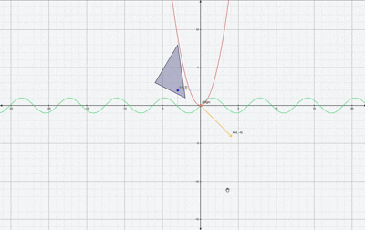

````markdown
# AxisJS 📐



A zero-dependency, high-performance interactive Cartesian coordinate plane for the web. Designed to produce a clean, classic "math textbook" aesthetic using HTML5 Canvas and TypeScript.

AxisJS handles infinite panning, smooth adaptive scaling, high-DPI (Retina) display support, and complex mathematical function plotting with absolute precision.

---

## ✨ Features

- ** High-Performance Rendering:** Built using a custom vanilla rendering engine that utilizes viewport culling, canvas path batching, and reactive loops (`isDirty` flag optimization). Handles complex functions smoothly at 60fps.
- ** Textbook Aesthetic:** Automatically draws sharp physical axis tick marks, coordinate system direction arrows, and mathematical axis alignment labels.
- ** Strictly Typed:** Built entirely in TypeScript with native, fully exported type interfaces for all plotting entities, coordinates, and configurations.
- ** Diverse Drawing Toolkit:**
  - **Points & Labels:** Plot absolute coordinates with floating text annotations and optional dashed projection guidelines extending to the axes.
  - **Line Segments:** Connect custom coordinates directly with variable thickness and custom styling.
  - **Filled Polygons:** Render geometric areas like triangles, rectangles, or custom calculus bounds with semi-transparent fills.
  - **Continuous Math Functions:** Plot infinite curve equations safely, featuring automatic asymptote gap and discontinuity detection (e.g., curves like `y = tan(x)` or $f(x) = \frac{1}{x}$).
- ** Responsive & Interactive:** Full mouse drag-to-pan and wheel-to-zoom interactive logic with an elegant single-method implementation for layout resizing.

---

## Installation

Install AxisJS into your project via npm, yarn, or pnpm:

```bash
npm install axisjs
```
````

---

## Quick Start

### 1. Setup your HTML Container

Create a canvas element inside your HTML file. For the most responsive layout handling, wrap it in a full-sized container:

```html
<div style="width: 100vw; height: 100vh;">
  <canvas id="plane-canvas"></canvas>
</div>
```

### 2. Initialize and Plot with TypeScript/JavaScript

Import the engine, construct the plane, and map out your coordinates:

```typescript
import { CartesianPlane } from "axisjs";

// 1. Grab the canvas element from the DOM
const canvas = document.getElementById("plane-canvas") as HTMLCanvasElement;

if (canvas) {
  // 2. Initialize AxisJS
  const plane = new CartesianPlane(canvas, {
    stepSequences: [1, 2, 5], // Grid lines scale intelligently across these step iterations
  });

  // 3. Plot a continuous mathematical function: y = x² (Red Parabola)
  plane.addCurve((x) => Math.pow(x, 2), "#ff4757");

  // 4. Draw a semi-transparent geometric shape (Calculus Triangle example)
  plane.addPolygon(
    [
      { x: -6, y: 3 },
      { x: -2, y: 1 },
      { x: -3, y: 8 },
    ],
    "rgba(100, 100, 150, 0.4)", // Fill color
    "#444466", // Border outline color
    2, // Outline thickness
  );

  // 5. Draw a standalone vector/line segment
  plane.addLine(0, 0, 4, -4, "#feca57", 3);

  // 6. Plot key points of interest with text labels and dashed guides
  plane.addPoint(0, 0, "#ff4757", "Origin");
  plane.addPoint(-3, 2, "blue", "P(-3, 2)", true); // Renders textbook dashed guide lines to axes

  // 7. Handle window and canvas container resizing perfectly using the public API
  const resizeObserver = new ResizeObserver(() => {
    plane.resize();
  });
  resizeObserver.observe(canvas);
}
```

> 💡 **Note for Vanilla JavaScript Users:** If you are building a pure JavaScript application rather than using TypeScript, simply remove the `as HTMLCanvasElement` type assertion from step 1.

---

## 📖 API Reference

### `new CartesianPlane(canvas, config?)`

Initializes a coordinate grid canvas interface.

| Parameter | Type                | Description                                                                   |
| --------- | ------------------- | ----------------------------------------------------------------------------- |
| `canvas`  | `HTMLCanvasElement` | The canvas DOM target element to draw on.                                     |
| `config`  | `PlaneConfig`       | _(Optional)_ Initial configuration choices for numbers and scale adjustments. |

#### `PlaneConfig` Options

- `stepSequences?: number[]` — Custom number intervals for major grid scaling transitions (defaults to `[1, 2, 5]`).

---

### Public Drawing Methods

#### `.addPoint(x, y, color?, label?, showGuides?)`

Places a point marker onto the plane.

- `x`, `y` (`number`): The target coordinate location on the plane.
- `color` (`string`): Hex, RGB, or named string color for the point.
- `label` (`string`): Optional floating text displayed near the point.
- `showGuides` (`boolean`): If `true`, renders dashed tracking grid lines from the point back to both axes.

#### `.addLine(x1, y1, x2, y2, color?, thickness?)`

Draws a straight line vector between two coordinates.

- `x1`, `y1` / `x2`, `y2` (`number`): Start and end coordinates.
- `thickness` (`number`): Overriding pixel stroke width weight.

#### `.addPolygon(points, fillColor?, strokeColor?, thickness?)`

Draws a connected polygon shape area.

- `points` (`{ x: number, y: number }[]`): Array of coordinate locations forming the perimeter.

#### `.addCurve(fn, color?)`

Renders an infinite mathematical function equation onto the grid.

- `fn` (`(x: number) => number`): A standard callback evaluation function (e.g., `(x) => Math.sin(x)`).

---

### Control Methods

#### `.resize()`

Forces the viewport to recalculate internal device pixel ratios, viewport dimension matrices, and triggers an immediate frame re-render. Call this inside your layout resize observers.

#### `.destroy()`

Cancels pending global frame requests and dismantles active event tracking listeners on elements to safeguard the host application against memory leaks.

---

## 🛠️ Performance Optimization Details

AxisJS was engineered ground-up to handle continuous panning and zooming operations without micro-stuttering:

1. **Viewport Culling:** The math renderer calculates absolute screen visibility margins and skips compute processing for lines, shapes, and metrics operating out of frame bounds.
2. **Path Batching:** Eliminates standard single-operation canvas overhead context switching by buffering elements and streaming grouped strokes to memory simultaneously.
3. **High-DPI Matrix Alignment:** Automatically tracks dynamic `window.devicePixelRatio` adjustments and scales element pixel ratios appropriately to preserve sharp vector geometry presentation on devices like Retina screens.

---

## 🤝 Contributing

Contributions are welcome! AxisJS uses a strictly decoupled, highly modular architecture designed to make codebase scaling straightforward:

- `core/`: Core mathematical rendering engines and state matrices (`Viewport`, `ScaleManager`, `InputController`).
- `rendering/`: Pure graphic drawing drivers transforming viewport coordinates into canvas pixels (`GridRenderer`, `PlotRenderer`, `AxisRenderer`).
- `entities/`: Strongly typed structural models mapping layout data arrays (`Point`, `Polygon`, `LineSegment`, `FunctionCurve`).

Please ensure all tests pass and file paths remain modularized before submitting a pull request.

---

## 📄 License

This project is licensed under the MIT License - see the LICENSE file for details.

```

```
